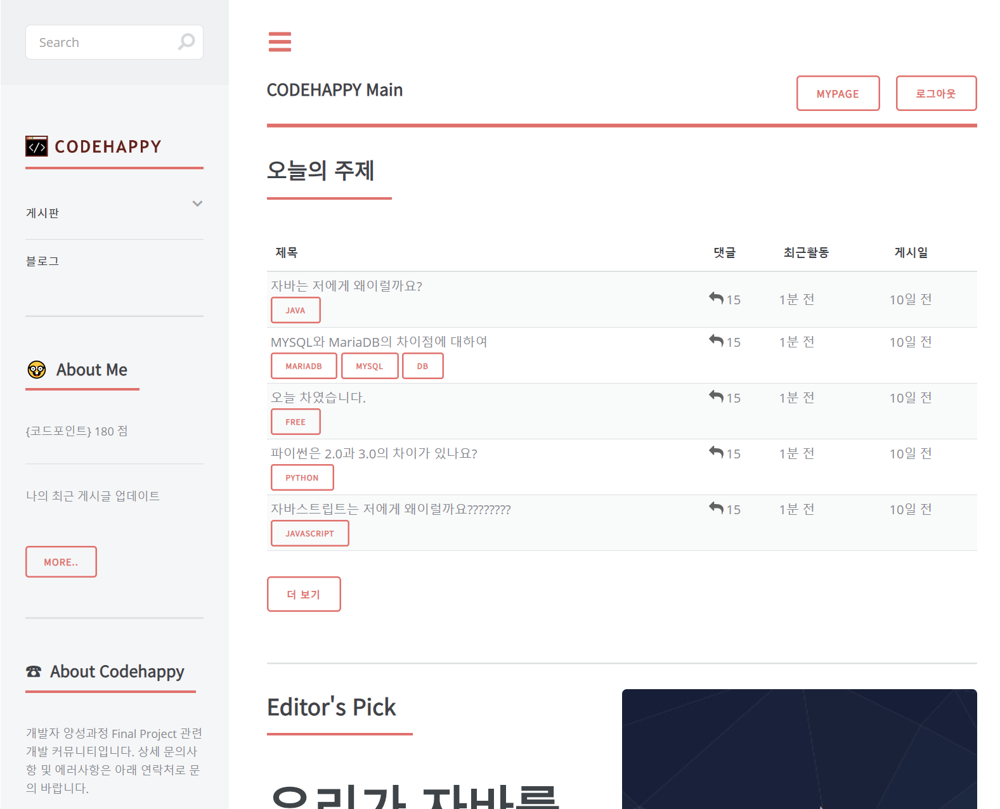

# team34-final-project(Codehappy)
KH Programming bootcamp final project(Coded by Okchul Kim, Heesuk Yoon)

## Tech-stack
Client-side : HTML5, CSS3, Bootstrap
Server-side : JAVA Spring MVC, MariaDB

## Portfolio Introduction

Web application aimed at software engineers.(same as [stackoverflow](http://www.stackoverflow.com), [hashcode](http://www.hashcode.co.kr), and so on)
In this site, we can provide space that sharing problems, talking about free theme, and blog.
Each member has own activity points, so more active, they gain more points.

It includes code snippet, XSS filter, and other useful libraries.

Welcome, and *CODEHAPPY*!
