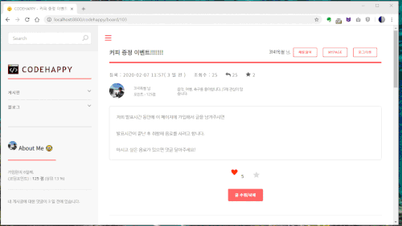

# team34-final-project(Codehappy)

> KH Programming bootcamp final project(Coded by Okchul Kim, Heesuk Yoon)

## Portfolio Introduction

Web application aimed at software engineers.(same as [stackoverflow](http://www.stackoverflow.com), [hashcode](http://www.hashcode.co.kr))
In this site, we can provide space that sharing problems, talking about free theme, and blog.
Each member has own activity points, so more active, they gain more points.

## Portfolio Detail 

### Board & Blog

CODEHAPPY has two board types(Board, Blog(Uploading pictures)). User can write and reply to other's article. Article selected to other users or get liked article gains point. And it makes user more valuable. 

### Search Function

CODEHAPPY includes two types of search. One is query search, and the other one is tag search. In search list, users can see 10 results in max. If users see further results, it's also possible. In detailed result page, users can sort the result.(fetch api)

### Add Star Function, and etc,.

CODEHAPPY offers 'add star function'. Users can see starred list in MYPAGE.

And CODEHAPY also includes code snippet, XSS filter, Email validation, and other useful libraries.

Welcome, and *CODEHAPPY*!

## Project stack

*Client-side*
* HTML5
* CSS3
* Bootstrap
* More ES6+ Javascript, Less JQuery

*Server-side*
* Spring Framework(MVC Pattern)
* Mybatis Framework
* Synology DB Server(for MariaDB 10)

*Chating application(Using `node.js`) is here!* [Go to Chat-app](http://github.com/oggy-kim/team34-chatapp)